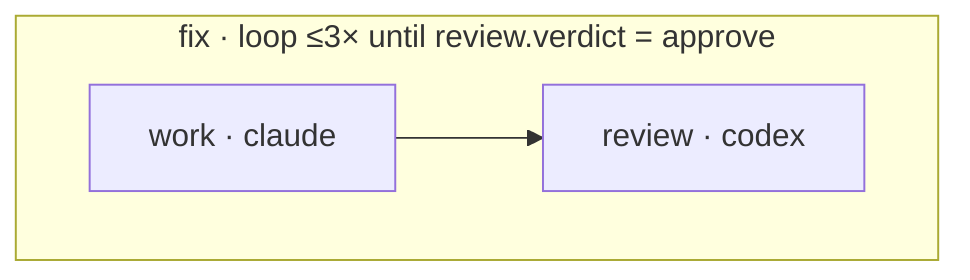
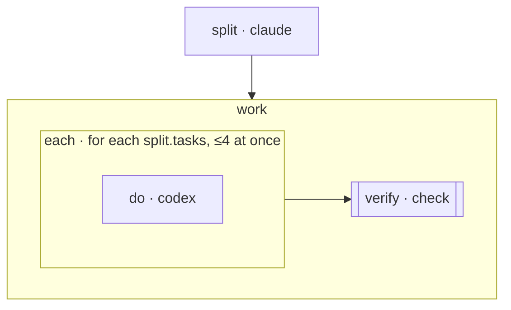
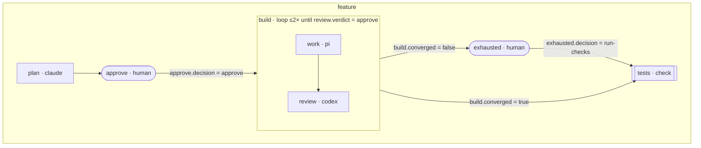

# Workflow engine

This is the design for follow-up 2 of [acp-workflows.md](acp-workflows.md): the
code-defined workflow engine ([spec 495](../product-specs/495-design-hive-s-workflow-engine-typed-ts-workflows-a.md)).
Spec 492 already settled two things, and this doc does not reopen them:
- **The transport.** Agents run as `acp` sessions owned by `hived` (spec 496).
- **Where the engine lives.** It is a bundled first-party 460 plugin. `hived`
  keeps ACP, `submit_result`, permissions and provenance.

This doc answers what 492 left open:
- how users write workflows;
- what graph they review before a run;
- how a run survives a crash, a restart or a reboot;
- whether to build an engine at all.

A runnable prototype backs the first two answers:
[`scripts/workflow-proto/`](../../scripts/workflow-proto/README.md). Every
graph shown below is generated by it, and CI fails when this doc and the
prototype disagree.

External facts were checked on **2026-10-05**; each one cites its source. Line
numbers are against `main` at `46b84f89`.

## Decisions at a glance

| Question | Decision |
|---|---|
| How workflows are written | A typed TypeScript builder. Generic constructs (`reviewLoop`, `fanOutThenVerify`, `planImplementVerify`) are higher-order functions that return subgraphs. |
| What is reviewed before a run | The IR: a static JSON graph, rendered as Mermaid (and later in the GUI). Conditions are data, loops are bounded, and fan-out is one template. |
| How runs survive failures | A SQLite checkpoint log owned by the engine plugin, written with Node's built-in `node:sqlite`. It needs no extra service. Completed nodes never re-run; an interrupted node is retried. |
| Where workflow files live | `<project>/.hive/workflows/*.ts`. They run on the user's Node and are type-checked by a checker Hive ships. |
| What a run reports | Events keyed by IR node id. They map onto OpenTelemetry's GenAI spans, and the GUI overlays them on the reviewed graph. |
| Go/no-go | **Go, custom**, gated on gate B. See [Go/no-go](#gono-go). |

## Writing a workflow

A workflow file is ordinary TypeScript that calls the builder once. The builder
records nodes and edges and returns the IR. Nothing runs at build time except
the file's own code, and no agent is contacted.

```ts
import { p, s, when, workflow } from '@hive/workflow';
import { reviewLoop } from '@hive/workflow/library';

export default workflow('review-loop', s.object({ task: s.string() }), (g, input) => {
  g.use('fix', reviewLoop(
    { agent: 'claude', mode: 'acceptEdits', prompt: p`Implement this task: ${input.task}`,
      output: s.object({ summary: s.string() }) },
    { agent: 'codex', mode: 'read-only', prompt: 'Review the change on this branch.',
      output: s.object({ verdict: s.enum('approve', 'revise'), feedback: s.string() }) },
    { maxIters: 3 },
  ));
});
```

### Node kinds

| Kind | Runs | Result |
|---|---|---|
| `agent` | An `acp` session: agent id, ACP mode, prompt template, timeout, and its own worktree or another agent node's (`worktree: { of }`). | The node's typed output, delivered through `submit_result` and validated against the node's output schema. |
| `check` | A command (`argv`) in the worktree of its upstream node. | `{ ok, exit_code }`. Every "tests pass" or "it builds" claim is a check node, never a model's word. |
| `human` | A question shown in the GUI. | A typed answer: for example `{ decision: 'approve' \| 'reject', note }`. |
| `group` | A named subgraph. | Nothing; inner nodes are referenced directly. |
| `loop` | Its body, repeated until `until` holds, at most `max_iters` (1–20) times. | `{ converged, iterations }`: `converged` is false when the bound ran out first. Later nodes can also read inner nodes' latest outputs. |
| `map` | One copy of its template per element of an array output (`over`), at most `concurrency` (1–16) at once. | `{ results }`: the template sink's outputs, in input order. |

There is no `llm` node, and Hive never calls a model API or holds a key.
Agents without ACP (a shell, Aider, custom agents) take part as `check` nodes or
through the escape hatch in [acp-workflows.md](acp-workflows.md#workflow-nodes).

### Typed outputs and references

Every agent and human node declares its output with a small schema builder:
`s.object`, `s.enum`, `s.string`, `s.number`, `s.boolean` and `s.array`. The
schema does two jobs:
- **Types.** `node.out.<field>` is a typed reference. TypeScript rejects a
  reference to a field the schema lacks, an enum value outside the enum,
  `lt`/`gt` on a non-number, and `map` over a non-array. The prototype's
  `types.check.ts` holds one `@ts-expect-error` per case, so the compiler
  proves them.
- **Data.** The IR carries the same schema as plain JSON Schema. That is what
  the node's `submit_result` call is validated against, so a result has the
  right shape before any condition reads it.

Prompts are templates. `` p`Do ${input.task}` `` stores
`Do {{input.task}}`, and the engine fills the placeholder at run time. Every
placeholder must resolve, or `validate` rejects the workflow.

### Why the graph stays static

The constructs a workflow needs are the ones that usually force code into the
graph: branches, loops, fan-out and reuse. Each one is designed so the IR is
complete before the run starts.

- **Conditional edges.** `when(review.out.verdict, 'eq', 'approve')` stores
  `{ ref, op, value }`, not a closure. The operators are `eq`, `ne`, `in`,
  `truthy`, `lt` and `gt`, combined with `all`, `any` and `not`. A condition
  can be printed, diffed and checked against the schema before the run. An
  arbitrary predicate could do none of that.
- **Loops.** `loop` is the only way to repeat. A back-edge anywhere else is a
  validation error. The loop's bound (`max_iters`) and exit test (`until`) are
  fields of the node, so the reviewed graph shows both. The iteration count is
  run state, not graph shape. Running out of rounds is an explicit outcome,
  not a silent pass: the loop's `converged` output is false, and the graph
  routes that case with an edge condition like any other.
- **Dynamic fan-out.** `map` holds one template subgraph. Only the number of
  copies is decided at run time, by the length of the array named in `over`.
  Each copy's events are keyed `<map>[<index>]/<node>`, so the overlay can show
  N copies under the one reviewed template.
- **Subgraph composition.** A construct is a `Fragment`: a function that takes
  a scope and an id and adds one node, usually a group, loop or map. `g.use(id,
  fragment)` applies it. Every node inside is prefixed with that id, so a
  construct can be used twice without collisions, and ids stay the same
  across rebuilds.

### Run semantics

The IR is read by an interpreter. These rules are what the interpreter
implements; they are part of the design, not an engine detail.

- **Ready.** A node is ready when every incoming edge has been settled. An edge
  is *taken* when its source finished and its condition holds (or it has
  none), and *not taken* otherwise.
- **Run or skip.** A ready node runs when at least one incoming edge was
  taken, and is skipped when none was. Alternative routes into one node (a
  converged loop, or a human's "run the checks anyway") therefore join
  without a special node. A skipped node's outgoing edges are not taken, so
  skipping propagates: a rejected plan skips everything after the approval.
- **References read upstream.** A prompt placeholder, `map.over` or
  `worktree.of` may name only a node that finishes before the reader starts,
  meaning upstream of it by edges, possibly across subgraphs. An edge
  condition may also read its own source and the nodes inside it. A loop's
  `until` may read its own body. `validate` rejects anything else, including a
  parallel sibling. A reference to an upstream node that was skipped reads
  as empty.
- **Subgraphs.** A group, loop or map starts at its body's entry nodes (those
  with no incoming edge inside the body). It is done when every node inside
  has finished or been skipped.
- **Loops.** Before each new iteration the loop evaluates `until` against the
  iteration that just ended. A reference from inside the body to a node later
  in the body reads the previous iteration's output, and is empty on the first
  one. That is the one exception to "references read upstream", and it is how
  `reviewLoop` hands the reviewer's feedback back to the worker.
- **Failure.** A node that fails after its retries fails its run. Optional
  error edges are left to the engine spec, because the prototype has no
  example that needs them.

### Worked examples

These three constructs are the prototype's library. Between them they cover
every case above.
- `reviewLoop` is a bounded loop with a typed exit.
- `fanOutThenVerify` is dynamic fan-out joined into a check node.
- `planImplementVerify` has a conditional edge on a human's typed decision,
  and composition: it nests `reviewLoop`.

Run `node scripts/workflow-proto/emit.ts <example>` to print any of them.

#### `reviewLoop(worker, reviewer, { maxIters })`

The worker implements and the reviewer reviews, repeated until the reviewer
approves or `maxIters` rounds have run. The reviewer works in the worker's own
worktree (`worktree: { of: 'fix/work' }`), so it reviews the actual change.

<!-- wf:reviewLoop:mermaid:start -->

<!-- wf:reviewLoop:mermaid:end -->

<details><summary>IR</summary>

<!-- wf:reviewLoop:ir:start -->
```json
{
  "ir": 1,
  "name": "review-loop",
  "input": {
    "type": "object",
    "properties": {
      "task": {
        "type": "string"
      }
    },
    "required": [
      "task"
    ],
    "additionalProperties": false
  },
  "nodes": [
    {
      "id": "fix",
      "kind": "loop",
      "max_iters": 3,
      "until": {
        "ref": "fix/review.verdict",
        "op": "eq",
        "value": "approve"
      },
      "nodes": [
        {
          "id": "fix/work",
          "kind": "agent",
          "agent": "claude",
          "mode": "acceptEdits",
          "worktree": "own",
          "timeout_s": 3600,
          "prompt": "Implement this task: {{input.task}}\n\nReviewer feedback from the previous round, if any: {{fix/review.feedback}}",
          "output": {
            "type": "object",
            "properties": {
              "summary": {
                "type": "string"
              }
            },
            "required": [
              "summary"
            ],
            "additionalProperties": false
          }
        },
        {
          "id": "fix/review",
          "kind": "agent",
          "agent": "codex",
          "mode": "read-only",
          "worktree": {
            "of": "fix/work"
          },
          "timeout_s": 3600,
          "prompt": "Review the change on this branch. Approve only if it is correct and tested.\n\nThe worker reports: {{fix/work.summary}}",
          "output": {
            "type": "object",
            "properties": {
              "verdict": {
                "type": "string",
                "enum": [
                  "approve",
                  "revise"
                ]
              },
              "feedback": {
                "type": "string"
              }
            },
            "required": [
              "verdict",
              "feedback"
            ],
            "additionalProperties": false
          }
        }
      ],
      "edges": [
        {
          "from": "fix/work",
          "to": "fix/review"
        }
      ]
    }
  ],
  "edges": []
}
```
<!-- wf:reviewLoop:ir:end -->

</details>

#### `fanOutThenVerify(items, step, verify)`

One copy of `step` per element of `items`, four at a time, then one check over
the combined work. The user's suggested signature had two arguments. This one
takes the verify step explicitly, because the pass/fail claim it makes must be
a check node.

<!-- wf:fanOutThenVerify:mermaid:start -->

<!-- wf:fanOutThenVerify:mermaid:end -->

<details><summary>IR</summary>

<!-- wf:fanOutThenVerify:ir:start -->
```json
{
  "ir": 1,
  "name": "fan-out-then-verify",
  "input": {
    "type": "object",
    "properties": {
      "goal": {
        "type": "string"
      }
    },
    "required": [
      "goal"
    ],
    "additionalProperties": false
  },
  "nodes": [
    {
      "id": "split",
      "kind": "agent",
      "agent": "claude",
      "mode": "plan",
      "worktree": "own",
      "timeout_s": 3600,
      "prompt": "Split this goal into independent tasks: {{input.goal}}",
      "output": {
        "type": "object",
        "properties": {
          "tasks": {
            "type": "array",
            "items": {
              "type": "string"
            }
          }
        },
        "required": [
          "tasks"
        ],
        "additionalProperties": false
      }
    },
    {
      "id": "work",
      "kind": "group",
      "nodes": [
        {
          "id": "work/each",
          "kind": "map",
          "over": "split.tasks",
          "concurrency": 4,
          "nodes": [
            {
              "id": "work/each/do",
              "kind": "agent",
              "agent": "codex",
              "mode": "workspace-write",
              "worktree": "own",
              "timeout_s": 3600,
              "prompt": "Do this task and nothing else: {{$item}}",
              "output": {
                "type": "object",
                "properties": {
                  "summary": {
                    "type": "string"
                  }
                },
                "required": [
                  "summary"
                ],
                "additionalProperties": false
              }
            }
          ],
          "edges": []
        },
        {
          "id": "work/verify",
          "kind": "check",
          "argv": [
            "go",
            "test",
            "./..."
          ],
          "timeout_s": 600
        }
      ],
      "edges": [
        {
          "from": "work/each",
          "to": "work/verify"
        }
      ]
    }
  ],
  "edges": [
    {
      "from": "split",
      "to": "work"
    }
  ]
}
```
<!-- wf:fanOutThenVerify:ir:end -->

</details>

#### `planImplementVerify(spec)`

Plan, then a human approves, then a review loop implements, then a check runs.
The edge into `build` is taken only on `decision = approve`; a rejection skips
the rest. When the review loop runs out of rounds without approval
(`converged = false`), the work does not fall through to the checks. A second
human node, `exhausted`, shows the last feedback and asks whether to run the
checks anyway or stop.

<!-- wf:planImplementVerify:mermaid:start -->

<!-- wf:planImplementVerify:mermaid:end -->

<details><summary>IR</summary>

<!-- wf:planImplementVerify:ir:start -->
```json
{
  "ir": 1,
  "name": "plan-implement-verify",
  "input": {
    "type": "object",
    "properties": {
      "spec": {
        "type": "string"
      }
    },
    "required": [
      "spec"
    ],
    "additionalProperties": false
  },
  "nodes": [
    {
      "id": "feature",
      "kind": "group",
      "nodes": [
        {
          "id": "feature/plan",
          "kind": "agent",
          "agent": "claude",
          "mode": "plan",
          "worktree": "own",
          "timeout_s": 3600,
          "prompt": "Write an implementation plan for: {{input.spec}}",
          "output": {
            "type": "object",
            "properties": {
              "summary": {
                "type": "string"
              },
              "steps": {
                "type": "array",
                "items": {
                  "type": "string"
                }
              }
            },
            "required": [
              "summary",
              "steps"
            ],
            "additionalProperties": false
          }
        },
        {
          "id": "feature/approve",
          "kind": "human",
          "prompt": "Approve this plan?\n\n{{feature/plan.summary}}",
          "output": {
            "type": "object",
            "properties": {
              "decision": {
                "type": "string",
                "enum": [
                  "approve",
                  "reject"
                ]
              },
              "note": {
                "type": "string"
              }
            },
            "required": [
              "decision",
              "note"
            ],
            "additionalProperties": false
          }
        },
        {
          "id": "feature/build",
          "kind": "loop",
          "max_iters": 2,
          "until": {
            "ref": "feature/build/review.verdict",
            "op": "eq",
            "value": "approve"
          },
          "nodes": [
            {
              "id": "feature/build/work",
              "kind": "agent",
              "agent": "pi",
              "mode": "unattended",
              "worktree": "own",
              "timeout_s": 3600,
              "prompt": "Implement the approved plan on this branch.\n\nApproved plan: {{feature/plan.steps}}\n\nReviewer feedback from the previous round, if any: {{feature/build/review.feedback}}",
              "output": {
                "type": "object",
                "properties": {
                  "summary": {
                    "type": "string"
                  }
                },
                "required": [
                  "summary"
                ],
                "additionalProperties": false
              }
            },
            {
              "id": "feature/build/review",
              "kind": "agent",
              "agent": "codex",
              "mode": "read-only",
              "worktree": {
                "of": "feature/build/work"
              },
              "timeout_s": 3600,
              "prompt": "Review the change on this branch. Approve only if it is correct and tested.\n\nThe worker reports: {{feature/build/work.summary}}",
              "output": {
                "type": "object",
                "properties": {
                  "verdict": {
                    "type": "string",
                    "enum": [
                      "approve",
                      "revise"
                    ]
                  },
                  "feedback": {
                    "type": "string"
                  }
                },
                "required": [
                  "verdict",
                  "feedback"
                ],
                "additionalProperties": false
              }
            }
          ],
          "edges": [
            {
              "from": "feature/build/work",
              "to": "feature/build/review"
            }
          ]
        },
        {
          "id": "feature/exhausted",
          "kind": "human",
          "prompt": "The review loop ran {{feature/build.iterations}} rounds without approval. Last feedback: {{feature/build/review.feedback}}\n\nRun the checks on the work as it stands, or stop?",
          "output": {
            "type": "object",
            "properties": {
              "decision": {
                "type": "string",
                "enum": [
                  "run-checks",
                  "stop"
                ]
              },
              "note": {
                "type": "string"
              }
            },
            "required": [
              "decision",
              "note"
            ],
            "additionalProperties": false
          }
        },
        {
          "id": "feature/tests",
          "kind": "check",
          "argv": [
            "scripts/test.sh",
            "go"
          ],
          "timeout_s": 600
        }
      ],
      "edges": [
        {
          "from": "feature/plan",
          "to": "feature/approve"
        },
        {
          "from": "feature/approve",
          "to": "feature/build",
          "when": {
            "ref": "feature/approve.decision",
            "op": "eq",
            "value": "approve"
          }
        },
        {
          "from": "feature/build",
          "to": "feature/tests",
          "when": {
            "ref": "feature/build.converged",
            "op": "eq",
            "value": true
          }
        },
        {
          "from": "feature/build",
          "to": "feature/exhausted",
          "when": {
            "ref": "feature/build.converged",
            "op": "eq",
            "value": false
          }
        },
        {
          "from": "feature/exhausted",
          "to": "feature/tests",
          "when": {
            "ref": "feature/exhausted.decision",
            "op": "eq",
            "value": "run-checks"
          }
        }
      ]
    }
  ],
  "edges": []
}
```
<!-- wf:planImplementVerify:ir:end -->

</details>

## The IR

The IR is the contract among the builder, the engine, the reviewer's picture
and the event overlay. Its keys are `snake_case`, like the wire protocol. Node
ids are lowercase words joined by single hyphens and nested with `/`, so a
Mermaid name can be derived from an id without collisions.

`validate(ir)` checks everything the type system can't see once a workflow is
plain JSON:
- unique ids;
- edges that stay inside one subgraph;
- no cycle outside `loop`;
- every reference and placeholder resolving to a declared field;
- every reference naming a node upstream of its reader, or a loop body's own
  node (see [Run semantics](#run-semantics));
- condition values that fit the field;
- the loop and map bounds;
- exactly one sink in a map template;
- no reference into a map body from outside it.

The engine runs `validate` again before every run, because the IR it runs is
whatever was stored, not what the types once checked.

<details><summary>IR JSON Schema (also committed as <code>scripts/workflow-proto/ir.schema.json</code>)</summary>

<!-- wf:schema:start -->
```json
{
  "$schema": "https://json-schema.org/draft/2020-12/schema",
  "$id": "https://github.com/lucascaro/hive/scripts/workflow-proto/ir.schema.json",
  "title": "Hive workflow IR",
  "type": "object",
  "properties": {
    "ir": {
      "const": 1
    },
    "name": {
      "type": "string"
    },
    "input": {
      "$ref": "#/$defs/objectSchema"
    },
    "nodes": {
      "type": "array",
      "items": {
        "$ref": "#/$defs/node"
      }
    },
    "edges": {
      "type": "array",
      "items": {
        "$ref": "#/$defs/edge"
      }
    }
  },
  "required": [
    "ir",
    "name",
    "input",
    "nodes",
    "edges"
  ],
  "additionalProperties": false,
  "$defs": {
    "node": {
      "oneOf": [
        {
          "$ref": "#/$defs/agent"
        },
        {
          "$ref": "#/$defs/check"
        },
        {
          "$ref": "#/$defs/human"
        },
        {
          "$ref": "#/$defs/group"
        },
        {
          "$ref": "#/$defs/loop"
        },
        {
          "$ref": "#/$defs/map"
        }
      ]
    },
    "agent": {
      "type": "object",
      "properties": {
        "id": {
          "type": "string",
          "pattern": "^[a-z][a-z0-9]*(-[a-z0-9]+)*(/[a-z][a-z0-9]*(-[a-z0-9]+)*)*$"
        },
        "kind": {
          "const": "agent"
        },
        "agent": {
          "type": "string",
          "minLength": 1
        },
        "mode": {
          "type": "string"
        },
        "worktree": {
          "oneOf": [
            {
              "const": "own"
            },
            {
              "type": "object",
              "properties": {
                "of": {
                  "type": "string",
                  "pattern": "^[a-z][a-z0-9]*(-[a-z0-9]+)*(/[a-z][a-z0-9]*(-[a-z0-9]+)*)*$"
                }
              },
              "required": [
                "of"
              ],
              "additionalProperties": false
            }
          ]
        },
        "timeout_s": {
          "type": "number",
          "exclusiveMinimum": 0
        },
        "prompt": {
          "type": "string"
        },
        "output": {
          "$ref": "#/$defs/objectSchema"
        }
      },
      "required": [
        "id",
        "kind",
        "agent",
        "worktree",
        "timeout_s",
        "prompt",
        "output"
      ],
      "additionalProperties": false
    },
    "check": {
      "type": "object",
      "properties": {
        "id": {
          "type": "string",
          "pattern": "^[a-z][a-z0-9]*(-[a-z0-9]+)*(/[a-z][a-z0-9]*(-[a-z0-9]+)*)*$"
        },
        "kind": {
          "const": "check"
        },
        "argv": {
          "type": "array",
          "items": {
            "type": "string"
          },
          "minItems": 1
        },
        "timeout_s": {
          "type": "number",
          "exclusiveMinimum": 0
        }
      },
      "required": [
        "id",
        "kind",
        "argv",
        "timeout_s"
      ],
      "additionalProperties": false
    },
    "human": {
      "type": "object",
      "properties": {
        "id": {
          "type": "string",
          "pattern": "^[a-z][a-z0-9]*(-[a-z0-9]+)*(/[a-z][a-z0-9]*(-[a-z0-9]+)*)*$"
        },
        "kind": {
          "const": "human"
        },
        "prompt": {
          "type": "string"
        },
        "output": {
          "$ref": "#/$defs/objectSchema"
        }
      },
      "required": [
        "id",
        "kind",
        "prompt",
        "output"
      ],
      "additionalProperties": false
    },
    "group": {
      "type": "object",
      "properties": {
        "id": {
          "type": "string",
          "pattern": "^[a-z][a-z0-9]*(-[a-z0-9]+)*(/[a-z][a-z0-9]*(-[a-z0-9]+)*)*$"
        },
        "kind": {
          "const": "group"
        },
        "nodes": {
          "type": "array",
          "items": {
            "$ref": "#/$defs/node"
          }
        },
        "edges": {
          "type": "array",
          "items": {
            "$ref": "#/$defs/edge"
          }
        }
      },
      "required": [
        "id",
        "kind",
        "nodes",
        "edges"
      ],
      "additionalProperties": false
    },
    "loop": {
      "type": "object",
      "properties": {
        "id": {
          "type": "string",
          "pattern": "^[a-z][a-z0-9]*(-[a-z0-9]+)*(/[a-z][a-z0-9]*(-[a-z0-9]+)*)*$"
        },
        "kind": {
          "const": "loop"
        },
        "max_iters": {
          "type": "integer",
          "minimum": 1,
          "maximum": 20
        },
        "until": {
          "$ref": "#/$defs/cond"
        },
        "nodes": {
          "type": "array",
          "items": {
            "$ref": "#/$defs/node"
          }
        },
        "edges": {
          "type": "array",
          "items": {
            "$ref": "#/$defs/edge"
          }
        }
      },
      "required": [
        "id",
        "kind",
        "max_iters",
        "until",
        "nodes",
        "edges"
      ],
      "additionalProperties": false
    },
    "map": {
      "type": "object",
      "properties": {
        "id": {
          "type": "string",
          "pattern": "^[a-z][a-z0-9]*(-[a-z0-9]+)*(/[a-z][a-z0-9]*(-[a-z0-9]+)*)*$"
        },
        "kind": {
          "const": "map"
        },
        "over": {
          "type": "string"
        },
        "concurrency": {
          "type": "integer",
          "minimum": 1,
          "maximum": 16
        },
        "nodes": {
          "type": "array",
          "items": {
            "$ref": "#/$defs/node"
          }
        },
        "edges": {
          "type": "array",
          "items": {
            "$ref": "#/$defs/edge"
          }
        }
      },
      "required": [
        "id",
        "kind",
        "over",
        "concurrency",
        "nodes",
        "edges"
      ],
      "additionalProperties": false
    },
    "edge": {
      "type": "object",
      "properties": {
        "from": {
          "type": "string",
          "pattern": "^[a-z][a-z0-9]*(-[a-z0-9]+)*(/[a-z][a-z0-9]*(-[a-z0-9]+)*)*$"
        },
        "to": {
          "type": "string",
          "pattern": "^[a-z][a-z0-9]*(-[a-z0-9]+)*(/[a-z][a-z0-9]*(-[a-z0-9]+)*)*$"
        },
        "when": {
          "$ref": "#/$defs/cond"
        }
      },
      "required": [
        "from",
        "to"
      ],
      "additionalProperties": false
    },
    "cond": {
      "oneOf": [
        {
          "type": "object",
          "properties": {
            "ref": {
              "type": "string"
            },
            "op": {
              "enum": [
                "eq",
                "ne",
                "in",
                "truthy",
                "lt",
                "gt"
              ]
            },
            "value": {}
          },
          "required": [
            "ref",
            "op"
          ],
          "additionalProperties": false
        },
        {
          "type": "object",
          "properties": {
            "all": {
              "type": "array",
              "items": {
                "$ref": "#/$defs/cond"
              }
            }
          },
          "required": [
            "all"
          ],
          "additionalProperties": false
        },
        {
          "type": "object",
          "properties": {
            "any": {
              "type": "array",
              "items": {
                "$ref": "#/$defs/cond"
              }
            }
          },
          "required": [
            "any"
          ],
          "additionalProperties": false
        },
        {
          "type": "object",
          "properties": {
            "not": {
              "$ref": "#/$defs/cond"
            }
          },
          "required": [
            "not"
          ],
          "additionalProperties": false
        }
      ]
    },
    "objectSchema": {
      "type": "object",
      "properties": {
        "type": {
          "const": "object"
        },
        "properties": {
          "type": "object",
          "additionalProperties": {
            "$ref": "#/$defs/valueSchema"
          }
        },
        "required": {
          "type": "array",
          "items": {
            "type": "string"
          }
        },
        "additionalProperties": {
          "const": false
        }
      },
      "required": [
        "type",
        "properties",
        "required",
        "additionalProperties"
      ],
      "additionalProperties": false
    },
    "valueSchema": {
      "oneOf": [
        {
          "type": "object",
          "properties": {
            "type": {
              "const": "string"
            },
            "enum": {
              "type": "array",
              "items": {
                "type": "string"
              },
              "minItems": 1
            }
          },
          "required": [
            "type"
          ],
          "additionalProperties": false
        },
        {
          "type": "object",
          "properties": {
            "type": {
              "const": "number"
            }
          },
          "required": [
            "type"
          ],
          "additionalProperties": false
        },
        {
          "type": "object",
          "properties": {
            "type": {
              "const": "boolean"
            }
          },
          "required": [
            "type"
          ],
          "additionalProperties": false
        },
        {
          "type": "object",
          "properties": {
            "type": {
              "const": "array"
            },
            "items": {
              "$ref": "#/$defs/valueSchema"
            }
          },
          "required": [
            "type",
            "items"
          ],
          "additionalProperties": false
        },
        {
          "$ref": "#/$defs/objectSchema"
        }
      ]
    }
  }
}
```
<!-- wf:schema:end -->

</details>

## Workflow files in a project

- **Where.** `<project>/.hive/workflows/<name>.ts`, one workflow per file as
  the default export. They are checked in with the project, so a team shares
  them by committing. The engine lists them when the GUI asks for a project's
  workflows. It reads the folder on demand and runs no file watcher.
- **Imports.** Files import `@hive/workflow` and `@hive/workflow/library`.
  These are not npm packages. The engine starts `node` with an `--import` hook
  that resolves both specifiers to the copies bundled inside the plugin, so
  the project needs no `package.json` and no `node_modules`.
- **Running without a toolchain.**
  - The user installs no TypeScript compiler, bundler or package.
  - The file runs on the user's own Node, which strips the types natively
    (unflagged since Node 22.18 and 23.6).
  - The engine finds Node through the login PATH, as ACP already does
    (`proc.LoginPATH`, `internal/agent/acp.go:111-116`). Plugins start on the
    daemon's PATH today, which often lacks it.
  - This adds no toolchain beyond what ACP sessions already need. Claude, Codex
    and Pi all launch through `npx` (`internal/agent/acp.go:84-102`), and
    `ACPAvailable` already requires it (`:152-160`).
  - With no suitable Node, the workflows panel shows the version it needs and
    nothing runs.
- **Type-checking.** Node strips types without checking them. So before a run
  the engine checks the file with a TypeScript checker that Hive ships:
  - which one is TypeScript 7's native `tsgo`, the same compiler the frontend
    pins;
  - how: against the bundled `@hive/workflow` declarations, with
    `erasableSyntaxOnly`.

  A type error blocks the run and shows in the GUI. The prototype proves this
  pairing: its own `.ts` files run unbuilt on Node 24 and type-check with
  `tsc -p scripts/workflow-proto`. **Open: the checker's size per platform**,
  to be measured in the engine spec.
- **Building is running code.** A workflow file executes when it is built. It
  is the project's own code, run at the user's request, like `scripts/test.sh`.
  The engine builds it in a child process. Where the user's Node supports it,
  that process runs under Node's permission model, with file-system reads only
  (`--permission`). Whether that model also fences the network on the user's
  Node version is **unverified** and left to the engine spec.
- **Editing a file during a run.** A run stores the IR it started with and a
  hash of the source. It interprets only that stored IR, never the file again,
  so an edit changes new runs only. The GUI marks a run whose source has
  changed since it started. Because the builder runs once and produces data,
  there is no replay, and no code-version skew of the kind Temporal must
  manage.

## Durable runs

**The requirement.** A run must survive three things:
- a plugin crash;
- a `hived` restart;
- a reboot.

It resumes per node: finished nodes never re-run, and an interrupted node is
retried. No always-on service may be added.

### Options compared

| | Local-only, single machine | Needs an always-on service | TS SDK quality | Determinism constraints vs hour-long agent calls | Waiting on a human | Cost | Lock-in | Fit with a data-defined graph |
|---|---|---|---|---|---|---|---|---|
| **Temporal** | Only through `temporal server start-dev`, which its docs call "not intended for production use". Temporalite is archived (2024-04). | Yes, the server | Mature (SDK 1.24, Node 20–24) | Workflow code must be deterministic. Long calls need activity heartbeats. History is capped at 51,200 events / 50 MB, so long loops need Continue-As-New. | Signals | MIT, free | High: its workflow API and replay model | Workable as one interpreter workflow, but the replay model buys nothing for a static graph |
| **Restate** | Yes: one binary with embedded RocksDB | Yes, `restate-server`; `hived` could spawn it, as a third stateful process | Current (1.17.2, 2026-09-21; Node ≥22) | Journaled `ctx.run` steps; no code replay | Awakeables / durable promises | BSL 1.1 (production use allowed; becomes Apache-2.0 after 4 years) | Medium–high | An interpreter handler works |
| **Inngest** | Yes: `inngest start`, with SQLite and an in-process Redis | Yes, the Inngest server | Mature; self-hosting has no support guarantee | **Steps are capped at 2 h**, and each step runs inside an HTTP call into the app | `waitForEvent`, up to a year | SSPL (becomes Apache-2.0 after 3 years) | High | Poor: event-driven and code-first |
| **DBOS Transact (TS)** | No: the TS SDK needs Postgres. SQLite PR #1288 is unmerged and scoped to dev/test. | Yes, Postgres | Active (v5) | Checkpointed steps; fine | `recv` / `setEvent` | MIT | Medium | Good for an interpreter, once SQLite lands |
| **SQLite event log (custom)** | Yes | **No**: a file in the plugin's data folder | Ours: about the size of the prototype | None: no replay; each node is one checkpointed step | A `waiting` row resolved from the GUI | Free | None: the IR is the schema | Native |

Two newer options fail the same requirement:
- **Vercel Workflow DevKit.** Its local "World" is labelled "intended for
  development", and its self-hosted backend is Postgres.
- **Absurd.** Postgres-only. Its model, explicit step checkpoints with no
  replay, is the one copied here.

Sources (accessed 2026-10-05):
- Temporal: [server](https://docs.temporal.io/cli/server), [limits](https://docs.temporal.io/workflow-execution/limits), [Temporalite](https://github.com/temporalio/temporalite)
- Restate: [architecture](https://docs.restate.dev/references/architecture), [TS SDK changelog](https://docs.restate.dev/changelog/typescript-sdk), [license](https://github.com/restatedev/restate/blob/main/LICENSE)
- Inngest: [self-hosting](https://www.inngest.com/docs/self-hosting), [limits](https://www.inngest.com/docs/usage-limits/inngest)
- DBOS: [config](https://docs.dbos.dev/typescript/reference/configuration), [#1288](https://github.com/dbos-inc/dbos-transact-ts/pull/1288)
- Vercel Workflow: [worlds](https://workflow-sdk.dev/docs/configuration/worlds)
- Absurd: [Absurd in production](https://lucumr.pocoo.org/2026/4/4/absurd-in-production/)

### Choice: a plugin-owned SQLite checkpoint log

The engine plugin keeps one database, `runs.db`, in its data folder
(`HIVE_PLUGIN_DATA_DIR`, which survives reinstalls: `internal/plugin/manager.go:158-162`).
It writes it with Node's built-in `node:sqlite`, so the database adds no
dependency and no native module.

**This needs a `DESIGN.md` change before it ships.** `DESIGN.md` says
`plugin-data/<id>/` is written only through the plugin Manager: the plugin's
config and log. A plugin writing its own database there is not covered. The
engine spec must add the carve-out: a plugin may write its own files under its
`plugin-data/<id>/`, still with atomic or transactional writes, and nothing
outside it. Until then this is a design, not a rule change. The registry
stays the only writer of session state either way. Each transition is one transaction in WAL mode with
`synchronous=FULL`. A transition is a node finishing, failing or starting to
wait, so writes are rare and the full fsync is cheap.

```sql
runs   (run_id PK, project, workflow, source_hash, ir JSON, input JSON,
        state,       -- running | waiting | done | failed | cancelled
        created_at, updated_at)
nodes  (run_id, key, -- instance path: fix[2]/work, work/each[3]/do
        node_id,     -- the IR id: fix/work
        state,       -- pending | running | waiting | done | failed | skipped | interrupted
        attempt, session_id, worktree, output JSON, error, started_at, ended_at,
        PRIMARY KEY (run_id, key))
events (run_id, seq, ts, key, type, data JSON, PRIMARY KEY (run_id, seq))
```

A node's output and its `done` state are written in the same transaction.
That is the whole exactly-once argument: a `done` node has its output, and no
other node state carries one.

### What happens on each failure

- **The plugin crashes.** `hived` restarts it with backoff
  (`internal/plugin/manager.go:22-34`). ACP sessions belong to `hived`, not the
  plugin, so a running agent node **keeps running**. On restart the engine
  reads every `running` node's `session_id`. If the turn finished while the
  plugin was down, its `submit_result` is already in the session's transcript
  (`ACP_TRANSCRIPT` carries `result_status` and `result`). The engine records
  it and moves on, with no retry. A check node's process dies with the plugin,
  so it is marked `interrupted`.
- **`hived` restarts, or the machine reboots.** ACP adapters and check
  processes are gone. On start, every `running` node becomes `interrupted`.
- **Retrying an interrupted node.** Its attempt count goes up, and it runs
  again, at most `max_attempts` times (default 2).
  - An agent node reopens its session with `session/load` when the agent
    supports it (`loadSession`), keeping the conversation. Otherwise it starts
    a new session in the **same worktree**, and the prompt says the last
    attempt was interrupted and the worktree may hold partial work.
  - Agent sessions are never resumed mid-turn.
- **A human node is waiting.** It just stays `waiting`. The question reappears
  in the GUI after any restart; the answer is written in the transaction that
  finishes the node.

**Open: `node:sqlite`'s stability tier** on the Node versions Hive supports is
unverified. The schema is plain enough that an append-only JSONL file with the
same records is a fallback, but SQLite transactions are simpler to get right.

## Runtime events and monitoring

Every state change appends one row to `events` and is pushed to the GUI live.

```ts
type RunEvent = {
  run_id: string;
  seq: number;       // per run, gapless; the replay order
  ts: string;        // RFC 3339
  key: string | null;     // instance path, e.g. "work/each[2]/do"; null for run-level events
  node_id: string | null; // the IR id, e.g. "work/each/do": what the overlay keys on
  attempt: number;
  type:
    | 'run.started' | 'run.finished'
    | 'node.ready' | 'node.started' | 'node.waiting' | 'node.output' | 'node.finished'
    | 'loop.iteration' | 'map.expanded'
    | 'agent.turn.started' | 'agent.turn.finished' | 'agent.message' | 'agent.tool' | 'agent.plan' | 'agent.usage'
    | 'check.output';
  data: Record<string, unknown>; // per type: status, session_id, stop_reason, tool_call_id, exit_code, …
};
```

### OpenTelemetry mapping

The GenAI semantic conventions are at Development status and live in
[`open-telemetry/semantic-conventions-genai`](https://github.com/open-telemetry/semantic-conventions-genai)
(accessed 2026-10-05). Events map onto them like this:

| Level | Span | Kind | Key attributes |
|---|---|---|---|
| Run | `invoke_workflow {workflow name}` | INTERNAL | `gen_ai.operation.name=invoke_workflow`, `gen_ai.workflow.name`, `hive.workflow.run_id` |
| Node | `workflow.node {node_id}` | INTERNAL | `hive.workflow.node.id`, `.key`, `.kind`, `.attempt`, `.state` |
| Agent turn | `invoke_agent {agent}` | CLIENT (the agent is another process) | `gen_ai.operation.name=invoke_agent`, `gen_ai.agent.name`, `gen_ai.conversation.id` (the ACP session id), usage from `usage_update` |
| Tool call | `execute_tool {tool name}` | INTERNAL | `gen_ai.operation.name=execute_tool`, `gen_ai.tool.name`, `gen_ai.tool.call.id` |

The conventions define no task or step span, so nodes use a Hive-named
`workflow.node` span. This keeps the run → node → turn → tool levels distinct
instead of reusing `invoke_agent` for two of them. A failed span sets
`error.type`. The `events` table stays the source of truth, and spans are
derived from it. Exporting them over OTLP is opt-in and belongs to spec 3
(monitoring); Hive has no OpenTelemetry dependency today and gains none here.

### The overlay

The GUI renders the run's stored IR, the same graph the user reviewed, and
colours each node from the events with that `node_id`.
- **Map copies** appear as a count on the template ("3 of 5 done"), and expand
  to one row per `key`.
- **Loops** show the current iteration out of `max_iters`.
- **A live run** streams events.
- **A finished run** replays the `events` table in `seq` order, so a run can be
  scrubbed after the fact with the same picture.

How events reach the GUI is a gap the engine spec must close. Today a plugin
has no way to push its own events to GUI clients.

## The ACP node layer

- **Capability detection.** The agent catalog (`internal/agent/acp.go`) says
  which agents have an ACP route, their modes, and whether they have an
  approval gate. Gemini and Copilot are marked experimental and refused today.
  The `initialize` response adds `loadSession`, `promptCapabilities` and
  `mcpCapabilities`, cached per adapter version.
  - `validate` in the engine refuses a workflow before the run when an agent
    node names an agent without a usable ACP route, or a mode its catalog
    entry doesn't list.
  - Retry-by-reload needs `loadSession`.
- **`session/update` to node events.** `hived` already folds updates into the
  transcript and the `acp` state tier (`internal/registry/acp.go:447-492`). The
  engine reads them through `ACP_TRANSCRIPT` deltas:

  | ACP update | Node event |
  |---|---|
  | prompt sent / `stopReason` | `agent.turn.started` / `agent.turn.finished` (`end_turn`, `max_tokens`, `max_turn_requests`, `refusal`, `cancelled`) |
  | `agent_message_chunk` | `agent.message`, coalesced per message rather than one row per chunk |
  | `tool_call`, `tool_call_update` | `agent.tool` |
  | `plan` | `agent.plan` |
  | `usage_update` | `agent.usage` |
  | `session/request_permission` | `node.waiting` with reason `permission`, answered by the user (trust model rule 4) |
  | `submit_result` recorded | `node.output`, then `node.finished` |

- **Results.**
  - Each agent node's output schema becomes its `submit_result` schema, and
    `hived` validates the result against it. Today's schema is fixed
    (`{ status, summary, data }`), so this is a gap.
  - **F3, Codex sometimes skips the injected tool.** On `end_turn` without a
    result, the engine re-prompts once, asking for `submit_result`. A second
    miss fails the node.
- **One worktree per node.** Each agent node gets its own worktree through
  Hive's model (`CreateSpec.UseWorktree`, `internal/wire/control.go:67-88`),
  on branch `hive/wf/<run-id>/<key>`.
  - **Branching.** It branches from its upstream node's branch, so a sequence
    sees prior work.
  - **`worktree: { of }`.** A node shares another agent node's worktree
    instead, as the reviewer in `reviewLoop` does, reading in a read-only mode.
  - **Fan-out.** Map copies branch from the same base. The node after a map
    runs in a merge worktree where the engine merges the copies' branches; a
    conflict fails that node and surfaces to the user.
  - **Cleanup.** Hive's dirty-worktree refusal (`ErrWorktreeDirty`) applies
    unchanged.
- **Cancellation and timeouts.**
  - Cancelling a run, or a node passing `timeout_s`, sends ACP's
    `session/cancel` and waits up to 10 s for `stopReason: cancelled`, then
    stops the session. `hived` implements no `session/cancel` today, so this is
    a gap; without it the only stop is killing the adapter.
  - Check nodes get SIGTERM to their process group, then SIGKILL.
- **Runaway caps.** All of these are in the IR or enforced per run:
  - `max_iters` (at most 20) and map `concurrency` (at most 16), in the IR;
  - a per-run cap on map copies (default 32), live agent nodes (default 4,
    trust model rule 5) and total agent turns (default 50);
  - the plugin token bucket (460).

  Hitting a cap fails the node with the cap named.
- **492's findings.**
  - **F2, one writer per Codex thread.** A node never shares an ACP session,
    and `{ of }` shares a worktree, not a session, so two nodes can't contend
    for a thread. A user who takes over a running Codex node gets the
    `acp_writer_locked` handling from spec 496 on hand-back. The node waits
    until it is handed back.
  - **F4, Codex calls the injected tool without asking in its default mode.**
    Every agent node names its mode. `validate` refuses a mode the catalog
    doesn't list, and the daemon caps it at the user's per-agent setting (trust
    model rule 3). With no mode given, the catalog's least-permissive default
    is used, which is `read-only` for Codex.
  - **F5, Pi ignores `mcpServers`.** Pi gets `submit_result` through Hive's Pi
    extension, as 496 built it. Pi nodes run only where the user allows
    unattended tool use.

## Risks

### Billing

Workflows run agents on the user's own subscription. Hive holds no key and
pays for no model call.

On 2026-10-05 Anthropic's support article ("Use the Claude Agent SDK with your
Claude plan", last updated 2026-06-16) says: "We're pausing the changes to
Claude Agent SDK usage described below. For now, nothing has changed: Claude
Agent SDK, `claude -p`, and third-party app usage still draw from your
subscription's usage limits."

The paused plan would have moved that usage off plan limits from 2026-06-15,
onto a separate credit that the article now says "isn't available". Zed's post
(2026-05-14, updated 2026-06-16) agrees that the change "is not taking effect
yet". It says Anthropic will "share advance notice before any future change".
No new date is set. Sources:
- [support.claude.com/en/articles/15036540](https://support.claude.com/en/articles/15036540-use-the-claude-agent-sdk-with-your-claude-plan)
- [zed.dev/blog/anthropic-subscription-changes](https://zed.dev/blog/anthropic-subscription-changes)

How the design hedges against that change returning:
- **Budgets.** Per-run caps on agent turns and live nodes bound what one run
  can spend, and `usage_update` is recorded per node, so cost is visible after
  every run.
- **Vendor mixing.** A node's agent is one field. A workflow can move
  Claude-heavy steps to Codex or Pi without changing shape.
- **Free checks.** Check nodes and human nodes cost nothing; the design pushes
  every pass/fail claim onto them.

### Security

Everything stays inside 492's trust model. The plugin is a principal, `hived`
stamps provenance, permission requests go to the user, and nothing escalates.

- **Hooks and MCP servers from untrusted worktrees.**
  - **The gap.** The Claude ACP adapter loads project settings by default.
    Claude Code shows no workspace-trust or `.mcp.json` prompt in a headless
    run, yet project hooks, its `env` block and `.mcp.json` servers still run
    ([permissions](https://code.claude.com/docs/en/permissions#what-runs-before-you-trust-a-folder),
    accessed 2026-10-05). A workflow node in a fresh worktree of a repo the
    user never trusted would run that repo's hooks with no prompt.
  - **Where it's fixed.** It affects shipped ACP sessions, not just workflows,
    and is filed as **#505**. The engine must not ship before it is fixed.
  - **Codex.** It loads project `.codex/` layers only for trusted paths; #505
    also verifies how `codex-acp` treats a path that was never trusted.
- **Trusting a project's workflow files.**
  - **The risk.** Building a workflow runs its `.ts` file, and a cloned
    repository can carry `.hive/workflows/`.
  - **The rule.** The engine never builds a project's workflow files until the
    user has confirmed, once per project, that they trust that folder. The
    confirmation is keyed by the project and the folder's path. It is asked
    again when the folder's contents change, as identified by a hash of its
    files. Opening a project never builds anything.
- **The builder's environment.** The child `node` that builds a workflow gets
  an allowlisted environment: `PATH`, `HOME`, `LANG`, `TZ`, plus the engine's
  own variables. The daemon's other variables are dropped, so nothing reaches
  a workflow file's top-level code by inheritance. That includes tokens and
  `HIVE_SOCKET`. Building has no reason to reach the network or the daemon.
- **Agent outputs in prompts are data.** A `{{node.field}}` placeholder pastes
  one agent's output into another agent's prompt, and that output may itself
  carry injected instructions from whatever the agent read. So the engine
  follows three rules:
  - It wraps every interpolated value in a delimited block labelled as the
    named node's output, with an instruction that its contents are data, not
    directions.
  - It never interpolates into anything but a prompt: no argv, no file path,
    no mode, no agent id. Those are fixed in the IR.
  - Pass/fail stays with check nodes and human nodes. A model's output can
    steer the next prompt, but never what counts as done.
- **Permission defaults.** Least-permissive mode unless the node names one,
  capped at the user's per-agent setting. The engine auto-answers only its own
  `submit_result`, matched on exact identity (F7).
- **Secrets.** The IR, the events and `runs.db` hold prompts, outputs and tool
  titles. Hive never reads the user's tokens, and workflow inputs are shown to
  the user before a run. An agent can still echo a secret it read in a
  worktree, so "never credentials" is enforced at three points:
  - **The file.** `runs.db` and its WAL files are created at mode `0600`.
  - **The events.** Before an event or output is stored, values matching
    common credential formats (private-key blocks, `AKIA…`, `ghp_…`,
    `sk-…`-style tokens, `Authorization:` headers) are replaced with
    `[redacted]`. The redaction is recorded in the event, so the gap shows
    in the overlay.
  - **OTel export.** It is opt-in. When on, it carries attributes and timings
    only: prompt and output content capture is off by default, the same
    default the GenAI conventions recommend.
- **Workflow files are code.** See [Workflow files in a project](#workflow-files-in-a-project).
  Building one runs it, as the user, at the user's request.

## Go/no-go

### The three options

1. **No engine.** Make hand-run sessions easier to follow: better visibility,
   with links between sessions. Nothing new to maintain. It leaves every
   problem in the spec standing except part of "can't see where each agent
   is". Hand-off, vendor mixing within a flow, and surviving a crash all stay
   manual.
2. **Mastra or LangGraph.js inside the 460 plugin, with ACP nodes as their
   steps.**
   - **LangGraph.js** is MIT, with a local `SqliteSaver`. But it has three
     problems here:
     - `interrupt()` **re-runs the whole node on resume**. That is unsafe
       around an ACP prompt, so each agent call would have to be split into
       separate nodes.
     - Conditional edges are functions, and `Send` targets are decided at run
       time, so `getGraph().drawMermaid()` can't show them statically.
     - Its SQLite saver needs the native `better-sqlite3` module, a packaging
       cost for a plugin that today has no dependencies.
   - **Mastra's** core is Apache-2.0. Its `ee/` code needs a commercial key
     from 2026-09-22, and the engine must not touch it. It is a full framework,
     and file-backed LibSQL durability was not confirmed. Its graph exists
     after `.commit()`, but conditions are functions there too.
   - **What both need from Hive.** Either one would still need a layer to:
     - turn conditions into data the reviewer can see;
     - key events by a stable node id for the overlay;
     - make ACP nodes interrupt-safe;
     - map run state onto their checkpoint stores.
3. **Custom.** The prototype's builder, IR and validator (about 840 lines with
   the library and Mermaid renderer), plus an interpreter and the SQLite log
   described above. The interpreter and log are estimated at 1,000–1,500 lines;
   they are not built yet. Absurd's TS SDK is about 1,400 lines for the same
   checkpoint model.

### Threshold

Adopt a framework if the adapter it needs is under half the custom core it
replaces. Today, that adapter covers:
- data conditions;
- node-id event keys;
- interrupt-safe ACP nodes;
- IR export and Mermaid;
- checkpoint mapping.

That is most of the prototype, about 840 lines, against a custom core of
roughly 1,800–2,300 lines, so the ratio comes out near one-half to one-third.
That is **at** the threshold, not under it. The framework also adds the
dependency weight, license terms and native modules noted above. So the
adapter doesn't clearly pay for itself.

Usage evidence is a separate gate:
- **Gate C:** at least 5 runs in two weeks that the user would repeat.
- **Gate D:** at least 3 code-defined workflows, each reused at least 3 times.

They decide later whether monitoring and authoring get built. They don't
decide this design.

### Verdict: go, custom

Build option 3 as spec 2 (the code-defined workflow engine), with two
conditions:
- **Gate B passes first.** That is the ACP session kind's real-run log, tracked
  in #503.
- **#505 is fixed** before any workflow node runs in a worktree.

Re-check the threshold if LangGraph.js gains a static, data-only conditional
edge and a non-native SQLite saver. Either change shrinks the adapter enough
to flip it.

**If this were a no-go**, 492's follow-up 2 would become option 1.
- **What changes.** Instead of an engine, Hive would ship a run view over
  ordinary sessions:
  - group the sessions a user tags as one task;
  - show their ACP states and `submit_result` outputs side by side;
  - keep the reviewed-graph idea as a static checklist with no interpreter.
- **What follows.** Follow-ups 3 and 4 (monitoring and authoring) would be
  dropped, since there would be no run graph to monitor or author.

## What the engine spec must add

Each item below is something this design assumes and that `main` doesn't have
yet:
- **Provenance.** Stamp `workflow:<run-id>` as `SpawnedBy`. Today only
  `plugin:<id>` is stamped (`internal/daemon/daemon.go:2114-2121`).
- **Typed results.** A per-node `submit_result` schema, validated by `hived`.
- **Cancellation.** ACP `session/cancel` in `internal/acp`, and a frame for the
  plugin to send it.
- **Request/reply in the SDK.** The plugin SDK sends without matching replies
  to requests (`plugins/sdk/hive-plugin.mjs:350`).
- **Node for plugins.**
  - Plugins need to start with the login PATH, or the engine plugin needs to
    find Node itself (`internal/plugin/manager.go:683-697`).
  - The bundled-plugin embed must take a headless plugin; it is UI-only today
    (`plugins/embed.go:12`).
- **GUI events.** A way for the plugin to push run events to GUI clients.
- **Untrusted settings.** #505: no untrusted project hooks or MCP servers in
  ACP sessions.
- **Plugin-owned data.** A `DESIGN.md` carve-out letting a plugin write its own
  files (here `runs.db`) under `plugin-data/<id>/`. Today only the plugin
  Manager writes there.
- **Workflow trust.** The per-project workflow trust confirmation, the builder's
  environment allowlist, and secret redaction before events are stored. All
  three are in [Security](#security).

## Prototype

[`scripts/workflow-proto/`](../../scripts/workflow-proto/README.md) is the
evidence for the DSL and the IR. It executes no agents and has no dependency.
`node --test 'scripts/workflow-proto/*.test.ts'` runs its tests, and
`node scripts/workflow-proto/check-doc.ts docs/design-docs/workflow-engine.md`
fails when any generated block above has drifted.
